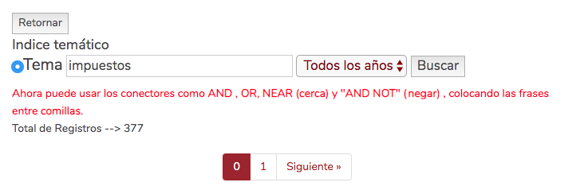

```{r setup, include=FALSE}
knitr::opts_chunk$set(
  echo = TRUE,
  message=TRUE
  )
```


Hoy les presento un paquete de R llamado [__ccc__](https://github.com/acastroaraujo/ccc) que creé motivado por un [tuit](https://twitter.com/LauFernanda/status/1234608623701110791) de una colega.

Para instalar el paquete sólo deben correr la siguiente línea:

```{r, eval=FALSE}
install.packages("devtools")
devtools::install_github("acastroaraujo/ccc")
```

Este paquete tiene funciones que permiten buscar sentencias usando una de las dos [interfases](https://www.corteconstitucional.gov.co/relatoria/) de la Corte Constitucional: "Índice temático" y "Palabra clave". 

_Nota. El número de resultados varía dependiendo de cuál interfaz se use._

En lo que sigue les muestro cómo usar este paquete para hacer un análisis de citaciones sobre el tema de impuestos en Colombia.

# Introducción

```{r, message=FALSE}
library(tidyverse)
library(ccc)

theme_set(
  theme_minimal(base_line_size = 1, base_family = "Avenir Next Condensed") +
  theme(
    plot.background = element_rect(size = 0, fill = "white"),
    plot.title = element_text(face = "bold", margin = margin(0, 0, 5, 0), size = 16),
    plot.subtitle = element_text(face = "italic", margin = margin(0, 0, 5, 0)),
    panel.grid = element_line(color = "#bebebe", size = 1/3)
  )
)
```

Usaré el ejemplo de las sentencias relacionadas al tema de "impuestos" en Colombia.

Para hacer esto manualmente deben entrar a este vínculo:

- https://www.corteconstitucional.gov.co/relatoria/tematico.php?sql=impuestos

```{r, echo=FALSE}

```


Para obtener los resultados de ambas páginas en R pueden hacer esto:

```{r}
resultado1 <- ccc_tema("impuestos", p = 0)
```

En la consola verán un cuadrado que les indica cuántas páginas son. En este caso —porque la página de la Corte empieza a contar desde el número cero— tenemos dos páginas. Entonces para obtener los resultados completos necesitamos descargar la segunda página también.

```{r}
resultado2 <- ccc_tema("impuestos", p = 1)
```

Yo prefiero usar la sintaxis del [tidyverse](https://www.tidyverse.org/), así:

```{r}
df <- map(0:1, ccc_tema, q = "impuestos") %>% 
  bind_rows()

glimpse(df)
```

Si miramos los resultados en detalle, podremos ver que algunos resultados no son exactamente lo que esperábamos. Esto se debe a que la expresión "impuestos por" aparece en los resultados sin que esto esté relacionado a temas tributarios.

```{r}
df %>% 
  filter(str_detect(topic, "impuestos por")) %>% 
  select(topic) %>% 
  sample_n(5) %>% 
  pull(topic)
```
Podemos tratar de arreglar esto cambiando la búsqueda original de la siguiente manera:

- `'"impuestos" AND NOT "impuestos por"'`

```{r}
df <- map(0:1, ccc_tema, q = '"impuestos" AND NOT "impuestos por"') %>% 
  bind_rows()

glimpse(df)
```

Como pueden ver, hay `r nrow(df)` observaciones. Sin embargo, algunas de estas sentencias podrían estar repetidas si aparecen en distintos temas.

```{r}
df %>% 
  count(sentencia, sort = TRUE) 
```

En efecto, la sentencia C-492-15 aparece en 19 temas distintos. Esta es la _muy controversial_ sentencia que le quitó los dientes al IMAN, sobre la que escribió el periodista Juanes Esteban Lewin [hace unos años](https://lasillavacia.com/historia/los-magistrados-se-bajaron-su-impuesto-de-renta-y-el-de-otros-empleados-privilegiados-51103).

Como no nos interesan las sentencias repetidas, simplemente eliminaremos la columna `topic` y luego las observaciones redundantes.

```{r}
df <- df %>% 
  select(-topic) %>% 
  distinct()
```

Esto nos deja con `r nrow(df)` sentencias sobre impuestos:

```{r}
glimpse(df)
```

Con esto es suficiente para empezar a hacer algunas visualizaciones:

```{r, code_folding="show code"}
year_seq <- seq(min(df$year), max(df$year), 2)

df %>% 
  count(year, type) %>% 
  mutate(type = factor(type, levels = c("A", "T", "C"))) %>% 
  ggplot(aes(year, n, fill = type)) + 
  geom_col() +
  scale_x_continuous(breaks = year_seq, labels = year_seq) + 
  labs(x = NULL, y = NULL, fill = "tipo", 
       title = "Fallos de la Corte Constitucional",
       subtitle = "tema: \'\"impuestos\" AND NOT \"impuestos por\"\'",
       caption = "\n@acastroaraujo")

```

Para completar este ejemplo les mostraré cómo construir la red de citaciones entre estas sentencias.

Pero primero necesitamos extraer el texto y pie de páginas de cada sentencia usando la función `ccc_texto_pp()`. 

Esto se puede demorar un rato...

```{r, message=FALSE}
df <- df %>% 
  mutate(texto = map_chr(path, ccc_texto_pp))

glimpse(df)
```

Una vez completado este paso, lo siguiente es usar la función `ccc_sentencias_citadas()` en cada texto. 

```{r}
citaciones <- map(df$texto, ccc_sentencias_citadas)
names(citaciones) <- df$sentencia

edge_list <- enframe(citaciones, name = "from", value = "to") %>% 
  unnest(to) %>% 
  count(from, to, sort = TRUE) 
```

El resultado es lo que se conoce en inglés como un "edge list":

```{r}
edge_list
```

Aquí podemos ver que la sentencia C-100-14 mencionó a la sentencia C-776-03 unas 48 veces!

También podemos contar el número de veces que una sentencia ha sido mencionada por otra de manera sencilla:

```{r}
edge_list %>% 
  count(to, sort = TRUE)
```

Estos datos son suficientes para construir una red usando el paquete __`igraph`__.

```{r, message=FALSE}
library(igraph)
library(ggraph)

g <- edge_list %>% 
  filter(to %in% df$sentencia) %>% ## reduce el núm. de nodos a las originales
  graph_from_data_frame()
```

Así se ve la red de citaciones:

```{r}
set.seed(123)

g %>% 
  ggraph("fr") +
  geom_edge_link(arrow = arrow(length = unit(1, "mm")),
                 end_cap = circle(1, "mm"), alpha = 0.5) + 
  geom_node_point(size = 0.5) +
  labs(title = "Fallos de la Corte Constitucional", 
       subtitle = "tema: \'\"impuestos\" AND NOT \"impuestos por\"\'",
       caption = "\n@acastroaraujo")
```

# Las sentencias más influyentes

Hay muchas formas de preguntarse cuáles de estas sentencias son las más influyentes.

El número de grados o "__degrees__" nos dice el número de veces que una sentencia ha sido citada por otras.

```{r}
V(g)$in_degree <- degree(g, mode = "in")
```

Estas son las 10 sentencias que con mayor número de citaciones:

```{r}
as_data_frame(g, "vertices") %>% 
  arrange(desc(in_degree)) %>% 
  head(10)
```

Otra forma de verlo es el concepto de "intermediación" o "__betweenness__" (i.e. el número de caminos más pequeños entre un nodo y otro). En otras palabras, se trata del número de veces en las cuales la sentencia actúa como puente entre otras dos sentencias.

```{r}
V(g)$betweenness <- betweenness(g, directed = TRUE)
```

Estas son las 10 sentencias que con mayor intermediación:

```{r}
as_data_frame(g, "vertices") %>% 
  arrange(desc(betweenness)) %>% 
  head(10)
```

La relación entre grados e intermediación no siempre es intuitiva. Aquí, la sentencia con mayor número de citaciones (C-155-03) está lejos de ser la sentencia con mayor grado de intermediación (C-776-03).

```{r}
nodos_influyentes_betweenness <- as_data_frame(g, "vertices") %>% 
  filter(betweenness >= 20)

as_data_frame(g, "vertices") %>% 
  ggplot(aes(betweenness, in_degree)) + 
  geom_point(size = 0.5) + 
  ggrepel::geom_label_repel(data = nodos_influyentes_betweenness, 
                            aes(label = name), size = 2, alpha = 3/4) 
```

La siguiente gráfica ajusta el color y tamaño de las sentencias para que reflejen su grado de intermediación.

```{r, preview=TRUE, code_folding="show code"}
set.seed(123)

g %>% 
  ggraph("fr") +
  geom_edge_link(arrow = arrow(length = unit(1, "mm")),
                 end_cap = circle(1.5, "mm"), alpha = 0.5) + 
  geom_node_point(aes(fill = betweenness, size = betweenness), 
                  shape = 21, color = "black", show.legend = FALSE) +
  scale_fill_gradient(low = "white", high = "red") + 
  labs(title = "Fallos de la Corte Constitucional", 
       subtitle = "tema: \'\"impuestos\" AND NOT \"impuestos por\"\'",
       caption = "\n@acastroaraujo")
```

_Cuáles son las sentencias que aparecen desconectadas?_

```{r}
index <- components(g)$csize <= 5

decompose(g)[index] %>% 
  map(~ V(.x)$name)
```

# Las sentencias nuevas más importantes (PageRank)

Esta idea se me acaba de ocurrir, entonces tocará consultar la literatura para estar seguros de que tenga sentido.

PageRank es un algoritmo creado por Google para medir la importancia de las páginas web. La idea consiste en que una página web es más importante si otras páginas importantes se dirigen a ella.

En el contexto de las sentencias, significa que las sentencias más importantes deben recoger mayor jurisprudencia. Intuitivamente, las sentencias de los años 90 serán "menos importantes" porque recogen menos citas; y las sentencias de años más recientes serán más importantes.

Para evitar malentendidos, que estas sentencias son las "más importantes" (de acuerdo a PageRank), quiero decir que recogen una mayor cantidad de precedente.

Antes de poner esta idea en marcha necesitamos revertir la dirección de la red de citaciones.

```{r}
g_invertido <- edge_list %>% 
  filter(to %in% df$sentencia) %>%
  select(to, from) %>% ## aquí invertimos la dirección
  graph_from_data_frame()

V(g_invertido)$page_rank <- page_rank(g_invertido)$vector
V(g_invertido)$num_sentencias_recogidas <- degree(g_invertido, mode = "in")
```

Entonces las 10 sentencias que más han recogido jurisprudencia anterior sobre impuestos son las siguientes:

```{r}
as_data_frame(g_invertido, "vertices") %>% 
  arrange(desc(page_rank)) %>% 
  head(10)
```

Finalmente, para chequear que nuestra intuición sea correcta, podemos visualizar la relación entre PageRank y año.

```{r}
extract_year <- function(x) {
    stringr::str_extract(x, "\\d{2}$") %>% as.Date("%y") %>% 
        format("%Y") %>% as.integer()
}

df_page_rank <- as_data_frame(g_invertido, "vertices") %>% 
  mutate(year = extract_year(name)) 
  
nodos_influyentes_page_rank <- df_page_rank %>% 
  filter(rank(-page_rank) <= 15)

df_page_rank %>% 
  ggplot(aes(year, page_rank)) + 
  geom_smooth() +
  geom_point(size = 0.5) + 
  ggrepel::geom_label_repel(data = nodos_influyentes_page_rank, 
                           aes(label = name), size = 3) +
  scale_y_log10() + 
  labs(x = NULL, title = 'Las sentencias nuevas más "importantes"',
       subtitle = "tema: \'\"impuestos\" AND NOT \"impuestos por\"\'",
       caption = "\n@acastroaraujo")
```

Eso es todo, aquí es dónde termina el análisis cuantitativo y empieza el ejercicio de lectura.

Chao.
