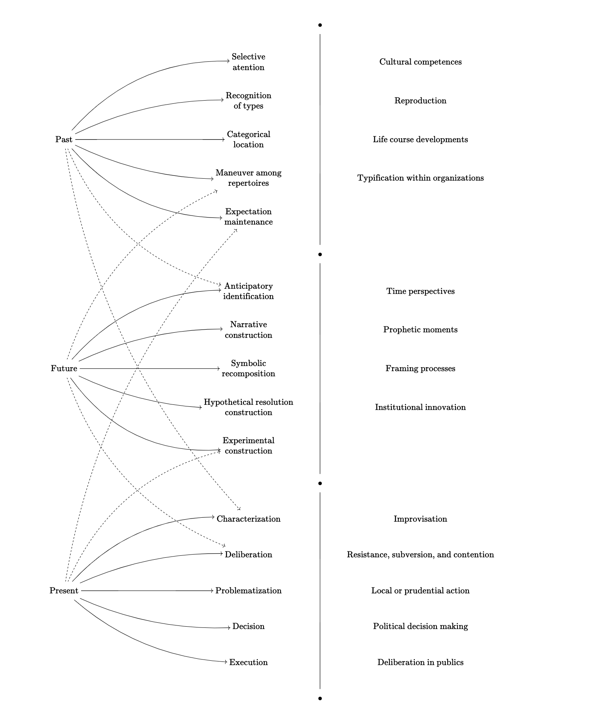

```{r setup, include=FALSE}
knitr::opts_chunk$set(echo = FALSE)
```

The word **agency** has been associated with a long list of words: *self-hood*, *motivation*, *will*, *purposiveness*, *intentionality*, *goal-seeking, judgement, deliberation, power, choice*, *initiative*, *freedom*, and *creativity*. Other times "agency" is defined as having the capacity to move and affect the world. Thus, it's reasonable to argue that *everyone* has *some* *form* of agency at any given time ---making agency a human constant just like "having a consciousness". However, it becomes an empirically variable phenomena as soon as we begin to talk more concretely about what agency means.

Usually I don't see the word "agency" thrown as much in sociology anymore, with the exception of how it's used in "life course" and "stress process" literature. Here, "agency" usually refers broadly to *the extent to which individuals control their lives* or the way in which that belief can sometimes be deployed as a resource to cope with stress [see @pearlin2010]. Sometimes "agency theory" might also be used to describe principal-agent relationships ---i.e., relationships that involve some form of delegation [@shapiro2005].

@emirbayer1998 define agency as a *temporally* *embedded process of social engagement* that takes place in different "structural environments" and which reproduces or transforms those structures at the same time. What's different about their approach is their emphasis on how different aspects of "agency" have a different *temporal orientation.* This effort to rethink agency in terms of time is similar in spirit to dual-process theories of culture and cognition [e.g. @lizardo2016; @vaisey2009 ].

**The past-future-present elements of human agency:**

<aside>

These are analytical distinctions:

</aside>

-   **Past, iteration, habit**[^1]**.**

    > the selective reactivation by actors of past patterns of thought and action, as routinely incorporated in practical activity, thereby giving stability and order to social universes and helping to sustain identities, interactions, and institutions over time [@emirbayer1998, pp. 971]

-   **Future, projectivity, imagination.**

    > the imaginative generation by actors of possible future trajectories of action, in which received structures of thought and action may be creatively reconfigured in relation to actors' hopes, fears, and desires for the future [@emirbayer1998, pp. 971]

-   **Present, Practical evaluation, judgement.**

    > the capacity of actors to make practical and normative judgments among alternative possible trajectories of action, in response to the emerging demands, dilemmas, and ambiguities of presently evolving situations [@emirbayer1998, pp. 971]

[^1]: Associated with words like: routines, dispositions, preconceptions, competences, schemas, patterns, typifications, and traditions. These words imply more "structure" than what we commonly think about as "agency".

<aside>

*All three of these constitutive dimensions of human agency are to be found, in varying degrees, within any concrete empirical instance of action. In this sense, it is possible to speak of a **chordal triad** of agency within which all three dimensions resonate as separate but not always harmonious tones* [@emirbayer1998, pp. 971-2]

</aside>

The musical metaphor that they chose to think about these issues ---**the chordal triad**--- allows them to talk about the "dominant" aspects of agency at any given time.

> ...each primary orientation in the chordal triad encompasses as subtones the other two as well, while also showing how this "chordal composition" can change as actors respond to the diverse and shifting environments around them [@emirbayer1998, pp. 972]

Thus, much like chords, each temporal orientation has dominant orientation (the "most resonant tone"), alongside *other* temporal orientations. The following diagram shows the different ways in which dissect the idea of "agency" or "agentic processes".

```{r, echo=FALSE}
## https://q.uiver.app/?q=WzAsMzYsWzAsMywiXFx0ZXh0e1Bhc3R9Il0sWzAsOSwiXFx0ZXh0e0Z1dHVyZX0iXSxbMCwxNSwiXFx0ZXh0e1ByZXNlbnR9Il0sWzQsMSwiXFx0ZXh0e1NlbGVjdGl2ZX0gXFxcXCBcXHRleHR7YXRlbnRpb259Il0sWzQsMiwiXFx0ZXh0e1JlY29nbml0aW9ufSBcXFxcIFxcdGV4dHtvZiB0eXBlc30iXSxbNCwzLCJcXHRleHR7Q2F0ZWdvcmljYWx9IFxcXFwgXFx0ZXh0e2xvY2F0aW9ufSJdLFs0LDUsIlxcdGV4dHtFeHBlY3RhdGlvbn0gXFxcXCBcXHRleHR7bWFpbnRlbmFuY2V9Il0sWzQsNCwiXFx0ZXh0e01hbmV1dmVyIGFtb25nfSBcXFxcIFxcdGV4dHtyZXBlcnRvaXJlc30iXSxbNCw4LCJcXHRleHR7TmFycmF0aXZlfSBcXFxcIFxcdGV4dHtjb25zdHJ1Y3Rpb259Il0sWzQsOSwiXFx0ZXh0e1N5bWJvbGljfSBcXFxcIFxcdGV4dHtyZWNvbXBvc2l0aW9ufSJdLFs0LDEwLCJcXHRleHR7SHlwb3RoZXRpY2FsIHJlc29sdXRpb259IFxcXFwgXFx0ZXh0e2NvbnN0cnVjdGlvbn0iXSxbNCw3LCJcXHRleHR7QW50aWNpcGF0b3J5fSBcXFxcIFxcdGV4dHtpZGVudGlmaWNhdGlvbn0iXSxbNCwxMSwiXFx0ZXh0e0V4cGVyaW1lbnRhbH0gXFxcXCBcXHRleHR7Y29uc3RydWN0aW9ufSJdLFs0LDEzLCJcXHRleHR7Q2hhcmFjdGVyaXphdGlvbn0iXSxbNCwxNCwiXFx0ZXh0e0RlbGliZXJhdGlvbn0iXSxbNCwxNSwiXFx0ZXh0e1Byb2JsZW1hdGl6YXRpb259Il0sWzQsMTYsIlxcdGV4dHtEZWNpc2lvbn0iXSxbNCwxNywiXFx0ZXh0e0V4ZWN1dGlvbn0iXSxbNSw1XSxbNSw2LCJcXGJ1bGxldCJdLFs1LDEyLCJcXGJ1bGxldCJdLFs1LDE4LCJcXGJ1bGxldCJdLFs1LDAsIlxcYnVsbGV0Il0sWzYsMTMsIlxcdGV4dHtJbXByb3Zpc2F0aW9ufSJdLFs2LDE0LCJcXHRleHR7UmVzaXN0YW5jZSwgc3VidmVyc2lvbiwgYW5kIGNvbnRlbnRpb259Il0sWzYsMTUsIlxcdGV4dHtMb2NhbCBvciBwcnVkZW50aWFsIGFjdGlvbn0iXSxbNiwxNiwiXFx0ZXh0e1BvbGl0aWNhbCBkZWNpc2lvbiBtYWtpbmd9Il0sWzYsMTcsIlxcdGV4dHtEZWxpYmVyYXRpb24gaW4gcHVibGljc30iXSxbNiw3LCJcXHRleHR7VGltZSBwZXJzcGVjdGl2ZXN9Il0sWzYsOCwiXFx0ZXh0e1Byb3BoZXRpYyBtb21lbnRzfSJdLFs2LDksIlxcdGV4dHtGcmFtaW5nIHByb2Nlc3Nlc30iXSxbNiwxMCwiXFx0ZXh0e0luc3RpdHV0aW9uYWwgaW5ub3ZhdGlvbn0iXSxbNiw0LCJcXHRleHR7VHlwaWZpY2F0aW9uIHdpdGhpbiBvcmdhbml6YXRpb25zfSJdLFs2LDMsIlxcdGV4dHtMaWZlIGNvdXJzZSBkZXZlbG9wbWVudHN9Il0sWzYsMiwiXFx0ZXh0e1JlcHJvZHVjdGlvbn0iXSxbNiwxLCJcXHRleHR7Q3VsdHVyYWwgY29tcGV0ZW5jZXN9Il0sWzAsMywiIiwwLHsiY3VydmUiOi00fV0sWzAsNCwiIiwyLHsiY3VydmUiOi0yfV0sWzAsNV0sWzAsNywiIiwwLHsiY3VydmUiOjJ9XSxbMCw2LCIiLDAseyJjdXJ2ZSI6NH1dLFsxLDcsIiIsMix7ImN1cnZlIjotNSwic3R5bGUiOnsiYm9keSI6eyJuYW1lIjoiZGFzaGVkIn19fV0sWzIsNiwiIiwyLHsiY3VydmUiOi01LCJzdHlsZSI6eyJib2R5Ijp7Im5hbWUiOiJkYXNoZWQifX19XSxbMSw4LCIiLDAseyJjdXJ2ZSI6LTJ9XSxbMSw5XSxbMSwxMCwiIiwwLHsiY3VydmUiOjJ9XSxbMCwxMSwiIiwwLHsiY3VydmUiOjUsInN0eWxlIjp7ImJvZHkiOnsibmFtZSI6ImRhc2hlZCJ9fX1dLFsyLDEyLCIiLDAseyJjdXJ2ZSI6LTUsInN0eWxlIjp7ImJvZHkiOnsibmFtZSI6ImRhc2hlZCJ9fX1dLFsxLDExLCIiLDEseyJjdXJ2ZSI6LTR9XSxbMSwxMiwiIiwxLHsiY3VydmUiOjV9XSxbMCwxMywiIiwxLHsiY3VydmUiOjUsInN0eWxlIjp7ImJvZHkiOnsibmFtZSI6ImRhc2hlZCJ9fX1dLFsyLDEzLCIiLDEseyJjdXJ2ZSI6LTR9XSxbMSwxNCwiIiwxLHsiY3VydmUiOjUsInN0eWxlIjp7ImJvZHkiOnsibmFtZSI6ImRhc2hlZCJ9fX1dLFsyLDE0LCIiLDEseyJjdXJ2ZSI6LTJ9XSxbMiwxNV0sWzIsMTYsIiIsMCx7ImN1cnZlIjoyfV0sWzIsMTcsIiIsMCx7ImN1cnZlIjozfV0sWzE5LDIwLCIiLDAseyJzdHlsZSI6eyJoZWFkIjp7Im5hbWUiOiJub25lIn19fV0sWzIwLDIxLCIiLDAseyJzdHlsZSI6eyJoZWFkIjp7Im5hbWUiOiJub25lIn19fV0sWzIyLDE5LCIiLDAseyJzdHlsZSI6eyJoZWFkIjp7Im5hbWUiOiJub25lIn19fV1d
```

```{r, echo=FALSE}

```

------------------------------------------------------------------------

**The structure vs agency problem**

@emirbayer1998 are obviously participating in this (in)famous philosophical debate that usually starts by pitting "structure" vs "agency" as two opposites and ends up being "resolved" by conflating them, by characterizing *both* structure *and* agency as two mutually constitutive (thus inseparable) phenomena. This notion is used as some sort of magical incantation: sociologists nod in agreement every time someone utters these words.

But they *are* analytically distinct.

> What becomes eclipsed in the notion of the inseparability of structure and agency is the degree of changeability or mutability of different actual structures, as well as *the variable (and changing) ways in which social actors relate to them.* In most central-conflationist views, the constitutive relationship between agency and structure is held analytically constant. We argue, by contrast, that while the temporal-relational contexts of action influence and shape agency and are (re)shaped by it in turn, the former is never so deeply intertwined with every aspect of the latter that these different analytical elements cannot be examined independently of one another [@emirbayer1998, pp. 1004]

There are times in wish to make this whole debate disappear, as I think it isn't a productive way to approach research. However, I'd be remiss if I didn't acknowledge at least two important reasons for why this debate keeps creeping back in in sociological discourse.

1.  It tends to make sociologists *bad writers,* particularly for two reasons: "the habitual use of passive constructions and abstract nouns" [@becker2008, pp. 8][^2]

    > One problem has to do with agency: who did the things that your sentence alleges were done? Sociologists often prefer locutions that leave the answer to that question unclear, largely because many of their theories don't tell them who is doing what. In many sociological theories, things just happen without anyone doing them. It's hard to find a subject for a sentence when "larger social forces" or "inexorable social processes" are at work [@becker2008, pp. 7-8].

2.  It directly informs our conversations about *causality* in a way that's consistent with what psychologists call "[attribution theory](https://en.wikipedia.org/wiki/Attribution_(psychology))". This also has moral and political implications.

    > Social scientists routinely look for the causes of the phenomena they study; it's the most common way of describing what we do. Moral judgments frequently take the form of assigning blame. Social scientists routinely assign blame by announcing what caused something to happen. If we know what causes something, we know what has to be changed in order to change some social consequence we disapprove of. [@becker2007, pp. 141-2]

    In a similar vein, @martin2011 mentions "attribution theory" when discussing some differences that arise between first-person and third-person explanations of social action, which tend to emphasize "freedom of choice" and "constraint" respectively.

    > When we think about others, we incompletely put ourselves in their shoes and do not fully appreciate the situational pressures they face; when we think about ourselves, we may not fully acknowledge that such pressures could be resisted. [@martin2011, pp. 22]

[^2]: Economists encounter similar issues when they invoke "market forces", "representative agents", "productivity", "equilibrium", among others.

Ultimately ***my own*** thoughts on agency mirror Bruno de Finetti's thoughts on probability.

> PROBABILITY DOES NOT EXIST
